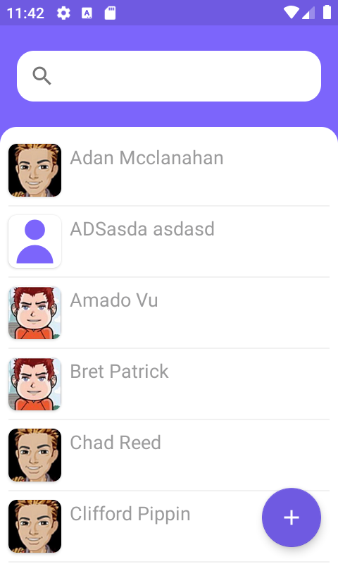

# Contacts

Projeto criado para exemplificar passos de como tornar sua aplicaçāo mais facil de se testar.

Neste projeto foram usadas as seguintes ferramentas:

* ViewModel
* Coroutines
* DataBinding
* Koin
* LiveData
* Robolectric
* Mockk

URL da apresentação: https://docs.google.com/presentation/d/16X-4YWzg7MQEf1R9P6EB6yxQRQhpt0ZxUgRmpbJ0nmE/edit?usp=sharing

